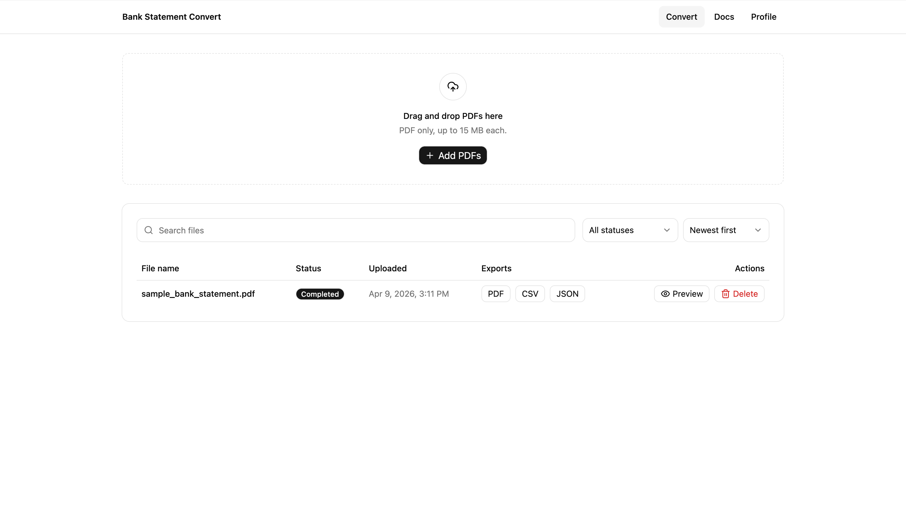
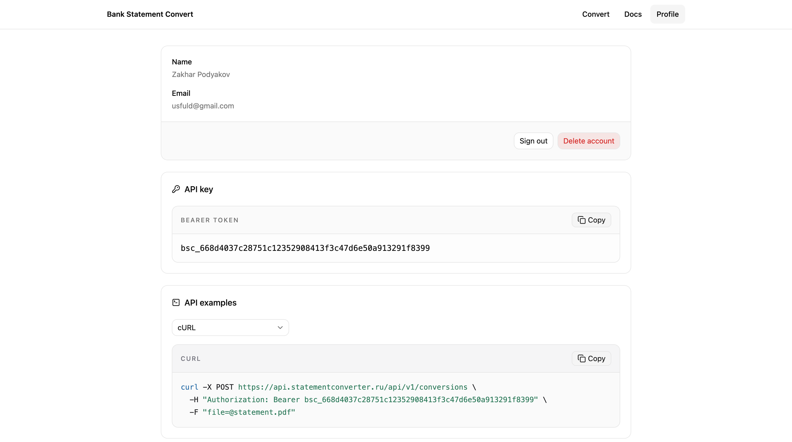
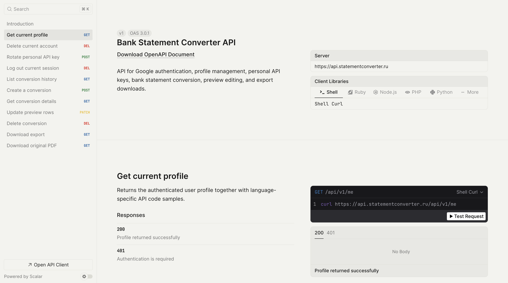
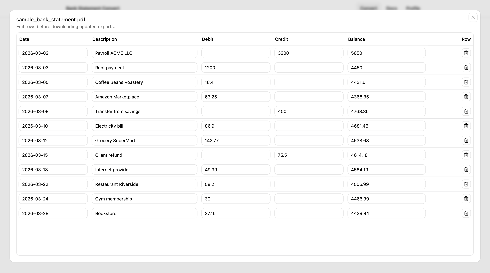

# Bank Statement Converter

Convert PDF bank statements into structured CSV and JSON with editable previews and personal API access.

## Demo

### Web app dashboard



### Profile with API key and code examples



### Interactive API documentation



### Editable conversion preview



## Product context

### End users

- Students, freelancers, and small business users who need transaction data from PDF bank statements
- Developers who want to automate statement conversion through an API

### Problem that the product solves

Bank statements are often provided as PDFs, which are difficult to reuse in spreadsheets, accounting workflows, or scripts. Manually retyping transactions is slow and error-prone.

### Solution

Bank Statement Converter lets a user upload a PDF bank statement, automatically extract structured transaction rows, review and edit the parsed result, and export the final data as CSV or JSON. The same functionality is also available through a documented API with personal bearer tokens.

## Features

### Implemented features

- Google sign-in
- PDF upload through the web interface
- Automatic conversion right after upload
- Conversion history with search and filters
- Editable preview table before export
- CSV and JSON export download
- Personal API key for each user
- API usage examples in several languages
- Public OpenAPI / Scalar API documentation
- Production deployment with frontend, backend, database, and docs host

### Not yet implemented

- Support for more bank-specific parsing presets
- Better validation for ambiguous or low-confidence rows
- Bulk export operations across multiple conversions
- Admin analytics and monitoring dashboard

## Usage

### Web app

1. Open the deployed product: [statementconverter.ru](https://statementconverter.ru)
2. Sign in with Google
3. Upload one or more PDF bank statements
4. Wait for automatic processing
5. Open preview, correct rows if needed
6. Download CSV or JSON

### API

1. Sign in to the web app
2. Open the `Profile` page
3. Copy your personal API key
4. Open the API docs: [docs.statementconverter.ru](https://docs.statementconverter.ru)
5. Call `POST /api/v1/conversions` with `Authorization: Bearer <token>` and a PDF file

## Version 1 and Version 2

### Version 1

Version 1 focused on one core feature: upload a PDF bank statement and convert it into structured export data.

Included in Version 1:

- Google authentication
- PDF upload
- backend conversion flow
- basic conversion history
- CSV / JSON export

### Version 2

Version 2 expanded the product into a more complete and polished tool.

Included in Version 2:

- automatic processing after upload
- editable preview before export
- search and filtering in conversion history
- personal API keys
- language-specific API examples in the profile
- public API docs with Scalar / OpenAPI
- production deployment on a VM with nginx, systemd, and PostgreSQL

### TA feedback addressed

- Improved product polish instead of keeping a rough prototype
- Added a clearer end-user flow from upload to export
- Added developer-facing API access and documentation
- Improved deployability and project presentation quality

## Tech stack

- Frontend: SvelteKit, TypeScript, Vite, shadcn-svelte
- Backend: Ruby on Rails API
- Database: PostgreSQL
- Auth: Google OAuth 2.0
- AI processing: OpenRouter-powered statement conversion
- Docs: OpenAPI + Scalar
- Deployment: Ubuntu 24.04, nginx, systemd

## Deployment

### Target OS

- Ubuntu 24.04

### What should be installed on the VM

- nginx
- Node.js
- Ruby
- Bundler
- PostgreSQL
- systemd

### Environment configuration

Create and fill the production environment file from:

- `.env.production.example`

Important variables:

- `FRONTEND_URL`
- `APP_URL`
- `API_BASE_URL`
- `DOCS_URL`
- `SESSION_COOKIE_DOMAIN`
- `ALLOWED_HOSTS`
- `GOOGLE_CLIENT_ID`
- `GOOGLE_CLIENT_SECRET`
- `OPENROUTER_API_KEY`
- `DATABASE_URL`
- `RAILS_MASTER_KEY`

### Step-by-step deployment

1. Copy the project to the server.
2. Configure the production environment variables.
3. Install backend dependencies:

```bash
cd backend
bundle install
RAILS_ENV=production bundle exec rails db:migrate
```

4. Install frontend dependencies and build:

```bash
cd frontend
bun install
bun run build
```

5. Copy the systemd units from `deploy/systemd/` into `/etc/systemd/system/`.
6. Copy nginx config from `deploy/nginx/` and docs host files from `deploy/docs/`.
7. Enable and start services:

```bash
sudo systemctl daemon-reload
sudo systemctl enable --now bank-statement-converter-backend
sudo systemctl enable --now bank-statement-converter-frontend
sudo nginx -t
sudo systemctl reload nginx
```

### Production URLs

- Product: [statementconverter.ru](https://statementconverter.ru)
- API: [api.statementconverter.ru](https://api.statementconverter.ru)
- Docs: [docs.statementconverter.ru](https://docs.statementconverter.ru)

## Local development

### Backend

```bash
cd backend
bundle install
cp .env.example .env
bin/rails db:prepare
bin/rails server
```

### Frontend

```bash
cd frontend
bun install
bun run dev
```

### Checks

Backend:

```bash
cd backend
bundle exec rspec
```

Frontend:

```bash
cd frontend
bun run check
bun run test
bun run build
```
